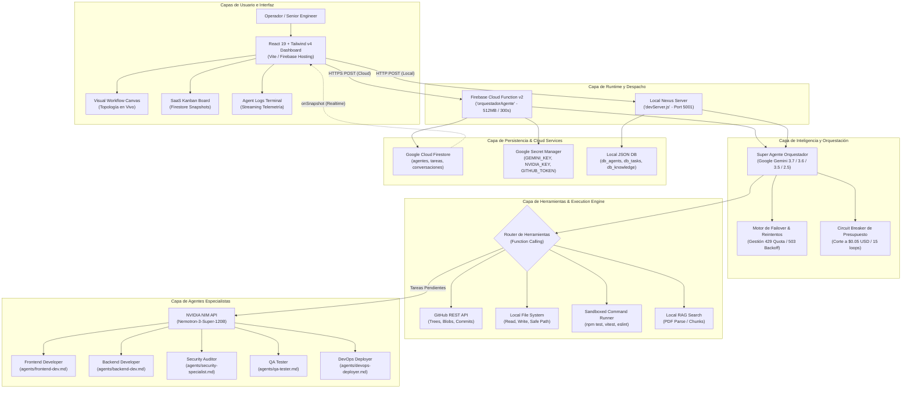
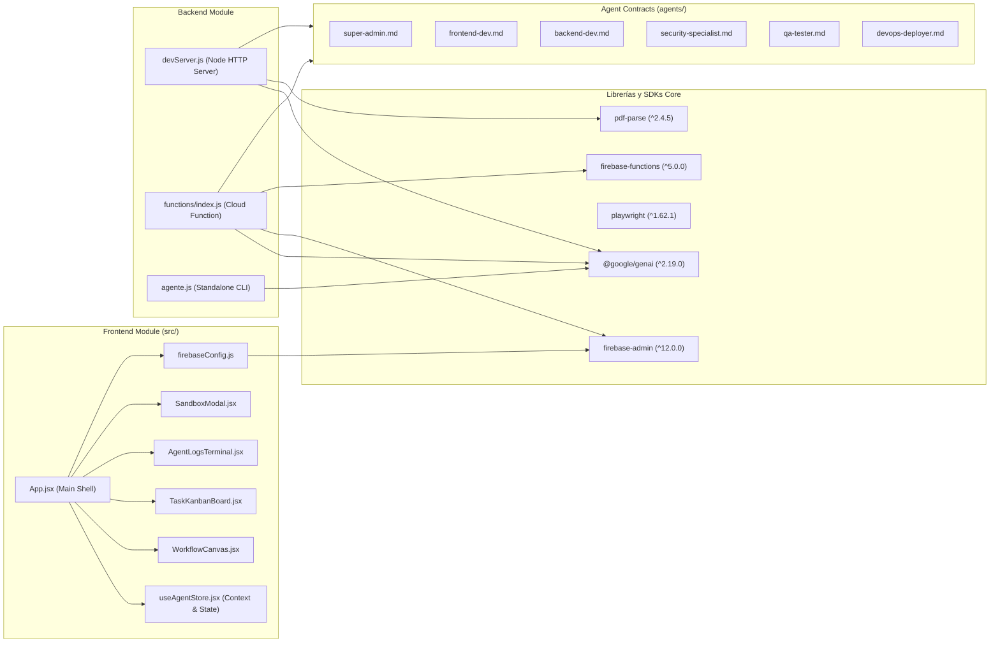
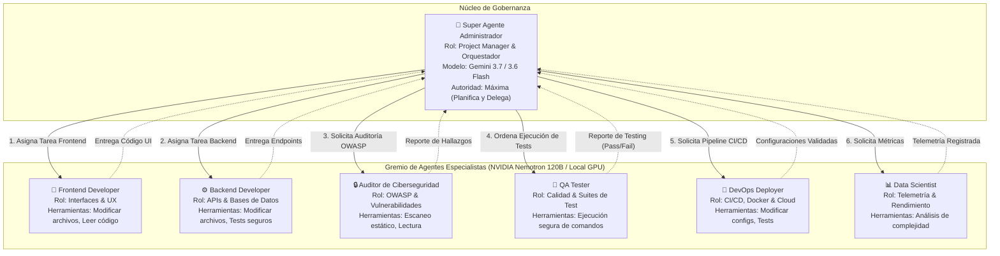
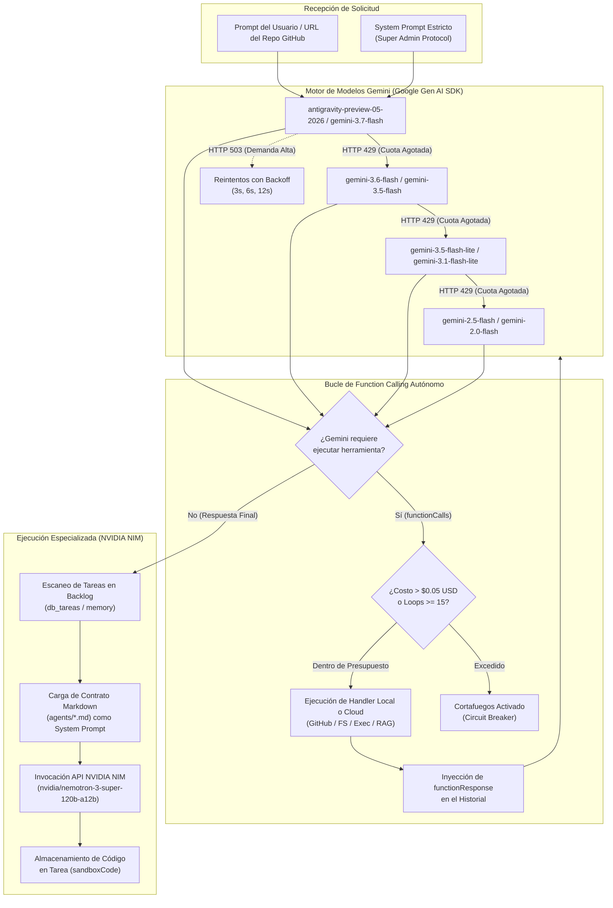
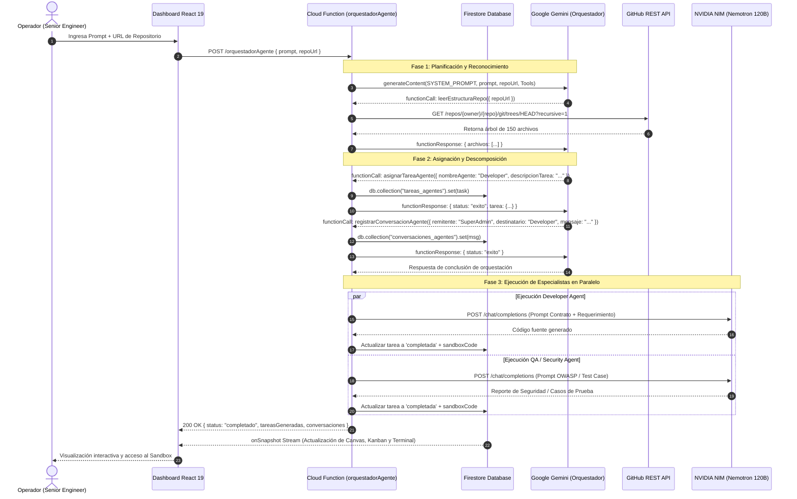
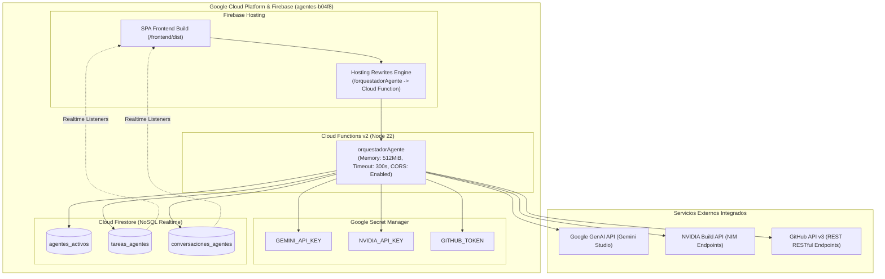
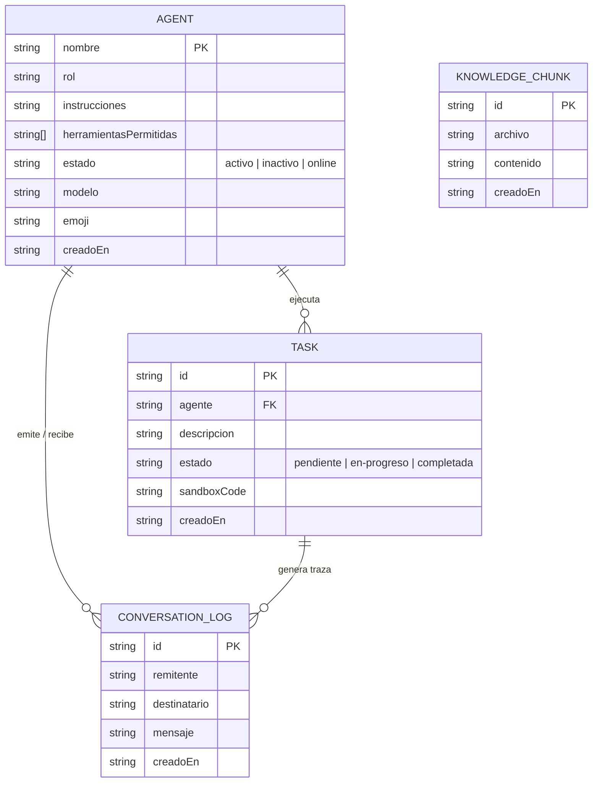
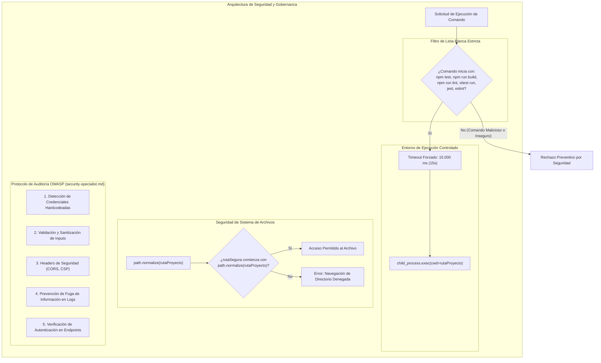
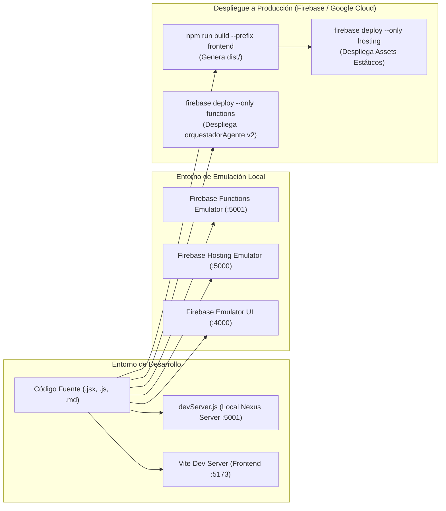

# Agentes — Enterprise Multi-Agent AI Operating System (Nexus OS)

Plataforma empresarial de orquestación y desarrollo de software autónomo multiagente impulsada por modelos de lenguaje de última generación (**Google Gemini**, **NVIDIA NIM Nemotron 120B** y soporte local en GPU). Diseñada para descomponer requerimientos de ingeniería de software, coordinar roles especializados (Frontend, Backend, Ciberseguridad, QA, DevOps) y ejecutar operaciones sobre repositorios locales y remotos de GitHub de manera supervisada o autónoma.

```
                  ┌──────────────────────────────────────────────┐
                  │          NEXUS AGENT OS ARCHITECTURE         │
                  └──────────────────────┬───────────────────────┘
                                         │
                 ┌───────────────────────┴───────────────────────┐
                 ▼                                               ▼
   ┌───────────────────────────┐                   ┌───────────────────────────┐
   │    CLOUD SERVERLESS RUNTIME│                   │   LOCAL HYBRID RUNTIME    │
   │  Firebase Cloud Functions │                   │    Node.js HTTP Server    │
   │  Firestore Realtime Sync  │                   │   Local File System & RAG │
   │  GitHub REST API Bridge   │                   │   Sandboxed Shell Exec    │
   └─────────────┬─────────────┘                   └─────────────┬─────────────┘
                 │                                               │
                 └───────────────────────┬───────────────────────┘
                                         ▼
                  ┌──────────────────────────────────────────────┐
                  │       SUPER ADMIN ORCHESTRATOR (GEMINI)      │
                  │   Decomposition • Tool Calling • Failover    │
                  └──────────────────────┬───────────────────────┘
                                         │
        ┌──────────────────┬─────────────┼─────────────┬──────────────────┐
        ▼                  ▼             ▼             ▼                  ▼
┌───────────────┐  ┌───────────────┐ ┌───────────────┐ ┌───────────────┐ ┌───────────────┐
│ Frontend Dev  │  │  Backend Dev  │ │Security Auditor│ │   QA Tester   │ │DevOps Deployer│
│  (React/UI)   │  │ (APIs/Data)   │ │(OWASP Checks) │ │ (Test Suites) │ │(CI/CD/Docker) │
└───────────────┘  └───────────────┘ └───────────────┘ └───────────────┘ └───────────────┘
```

---

## Descripción

**Agentes** resuelve el problema de la fragmentación y falta de gobernanza en la automatización del ciclo de vida de desarrollo de software (SDLC) mediante IA. A diferencia de interfaces de chat genéricas o agentes aislados, este sistema implementa una **Malla de Orquestación Jerárquica** donde un **Super Agente Administrador** (Project Manager) asume el rol exclusivo de análisis, descomposición técnica y delegación hacia subagentes especialistas, cada uno gobernado por contratos de trabajo en Markdown (`agents/*.md`), herramientas restringidas por listas blancas y políticas de seguridad OWASP.

El sistema opera bajo dos modalidades desacopladas:
1. **Modo Cloud Serverless**: Desplegado en **Firebase Cloud Functions 2nd Gen** con sincronización en tiempo real vía **Firestore**, secretos gestionados por **Google Cloud Secret Manager** e integración bidireccional con la **API de GitHub** (lectura de árboles, extracción de archivos, commits automatizados y búsqueda de código).
2. **Modo Local Autónomo**: Ejecutado sobre un servidor Node.js (`devServer.js`) con capacidad de inspección de disco duro local, ejecución de suites de pruebas reales (`npm test`, `jest`, `vitest`, `eslint`) dentro de un entorno seguro y base de conocimiento documental RAG (PDF/texto) procesada con `pdf-parse`.

---

## Key Features

- **🧠 Orquestación Jerárquica Dual (Cloud & Local):** Separación estricta de responsabilidades entre el Project Manager (planificación y supervisión) y los agentes ejecutores (código, auditoría y testing).
- **⚡ Enrutamiento Inteligente y Cascada de Fallover de IA:** Failover automático multimodelo en Google Gemini ante cuotas agotadas (HTTP 429) o sobrecarga transitoria (HTTP 503 con retroceso exponencial), junto a inferencia paralela de subagentes en NVIDIA NIM (`nemotron-3-super-120b-a12b`).
- **🛡️ Cortafuegos Financiero y Límite de Bucle (Circuit Breaker):** Medición de tokens de entrada/salida y costo estimado en USD en tiempo real, con corte preventivo automático si la sesión supera `$0.05 USD` o 15 iteraciones de herramientas.
- **🔒 Sandboxing y Sanitización de Comandos:** Lista blanca estricta de comandos de consola permitidos (`npm test`, `npm run build`, `npm run lint`, `vitest run`, `jest`, `eslint`), timeout forzado de 15 segundos y bloqueo riguroso de Path Traversal.
- **🐙 Integración Nativa con GitHub REST API:** Capacidad de explorar repositorios remotos, leer blobs de código, realizar búsquedas semánticas y emitir commits automáticos desde Cloud Functions.
- **📚 Motor RAG Documental Local:** Indexación y fragmentación semántica de PDFs y código (`pdf-parse`) con solapamiento (*chunk size: 1000*, *overlap: 200*) y búsqueda clasificada por relevancia.
- **📊 Tablero SaaS en Tiempo Real:** Dashboard interactivo en React 19 / Tailwind CSS v4 con topología de grafos en vivo (`WorkflowCanvas`), tablero Kanban sincronizado con Firestore y terminal de telemetría de logs (`AgentLogsTerminal`).
- **💻 Sandbox Interactivo de Entregables:** Visualizador integrado con soporte para inspeccionar código generado, copiar al portapapeles y descargar artefactos técnicos individuales.

---

## Architecture

### 1. Diagrama de Arquitectura General



---

## System Components



### Tabla de Responsabilidades por Componente

| Módulo / Archivo | Responsabilidad Primaria | Dependencias Críticas |
| :--- | :--- | :--- |
| [`frontend/src/App.jsx`](file:///frontend/src/App.jsx) | Shell de la interfaz de usuario, orquestación de pestañas, pasarela de eventos y conexión en tiempo real con Firestore `onSnapshot`. | React 19, Firebase SDK, Lucide Icons |
| [`frontend/src/store/useAgentStore.jsx`](file:///frontend/src/store/useAgentStore.jsx) | Almacén central de estado React para topología de agentes, tablero Kanban, bitácora de logs y estado del workflow. | React Context, State Hooks |
| [`frontend/src/components/WorkflowCanvas.jsx`](file:///frontend/src/components/WorkflowCanvas.jsx) | Grafo interactivo que dibuja la topología de la empresa multiagente, estados en vivo (*Running, Thinking, Active, Paused*) y controles de zoom/paneo. | Lucide Icons, Agent Context |
| [`devServer.js`](file:///devServer.js) | Servidor HTTP local (puerto 5001) para ejecución local con herramientas de sistema de archivos, ejecución segura de tests en consola y RAG. | `@google/genai`, `pdf-parse`, `dotenv`, `child_process` |
| [`functions/index.js`](file:///functions/index.js) | Función Serverless 2nd Gen (`orquestadorAgente`) en Google Cloud con conexión a GitHub REST API, Firestore y Secret Manager. | `firebase-functions`, `firebase-admin`, `@google/genai`, `cors` |
| [`agente.js`](file:///agente.js) | Agente autónomo CLI autocontenido demostrativo con bucle interactivo de llamadas a funciones y persistencia en `.txt`. | `@google/genai`, `dotenv`, Node `fs` |
| [`agents/*.md`](file:///agents/) | Contratos de trabajo estructurados en Markdown que inyectan el system prompt exacto, alcances y políticas de calidad de cada subagente. | N/A (Markdown Specifications) |

---

## Multi-Agent Architecture

### 1. Matriz de Agentes y Contratos Operacionales



### 2. Especificación Técnica de los Agentes

| Agente | Modelo Asignado | Misión Principal | Herramientas Permitidas | Restricciones de Seguridad |
| :--- | :--- | :--- | :--- | :--- |
| **Super Agente Administrador** | Google Gemini (Cloud) | Descomponer requerimientos, crear subagentes, orquestar tareas y validar entregables. | `crearSubAgente`, `asignarTareaAgente`, `actualizarEstadoTarea`, `leerEstructuraProyecto`, `leerContenidoArchivo`, `modificarArchivoProyecto`, `ejecutarComandoPrueba`, `buscarEnBaseConocimiento`, `registrarConversacionAgente` | **Prohibido** escribir código de implementación directamente. Debe delegar obligatoriamente. |
| **Frontend Developer** | NVIDIA Nemotron 120B | Desarrollar componentes React/Tailwind reutilizables, accesibles (ARIA) y responsivos. | `leerContenidoArchivo`, `modificarArchivoProyecto`, `registrarConversacionAgente` | Prohibido el uso de estilos inline; validación estricta de inputs del lado del cliente. |
| **Backend Developer** | NVIDIA Nemotron 120B | Diseñar endpoints REST, lógica de negocio y esquemas de datos seguros. | `leerContenidoArchivo`, `modificarArchivoProyecto`, `ejecutarComandoPrueba`, `registrarConversacionAgente` | Prohibida la concatenación de queries SQL; credenciales únicamente vía `.env`. |
| **Auditor de Ciberseguridad** | NVIDIA Nemotron 120B | Auditoría estática basada en guías OWASP (secrets expuestos, XSS, headers inseguros, sanitización). | `leerContenidoArchivo`, `leerEstructuraProyecto`, `registrarConversacionAgente` | **Solo lectura**. No ejecuta exploits activos ni modifica código directamente. |
| **QA Tester** | NVIDIA Nemotron 120B | Diseñar casos de prueba y ejecutar suites automatizadas (`jest`, `vitest`, `eslint`). | `ejecutarComandoPrueba`, `leerContenidoArchivo`, `registrarConversacionAgente` | Comandos de consola restringidos a la lista blanca; prohibido `rm`, `format` o comandos de git destructivos. |
| **DevOps Deployer** | NVIDIA Nemotron 120B | Gestionar pipelines de GitHub Actions, Dockerfiles y variables de entorno. | `ejecutarComandoPrueba`, `modificarArchivoProyecto`, `leerEstructuraProyecto`, `registrarConversacionAgente` | Obligatorio verificar `.dockerignore` y exclusión de `node_modules`. |

---

## AI Architecture



### Protocolo de Function Calling

El motor de orquestación utiliza las definiciones de esquemas JSON formales de `@google/genai` para habilitar el razonamiento basado en herramientas (*Tool-Augmented Generation*):

```javascript
// Esquema representativo de Tool Declaration en devServer.js y functions/index.js
{
  name: "ejecutarComandoPrueba",
  description: "Ejecuta un comando real de consola (npm test, eslint, vitest run) en el proyecto local.",
  parameters: {
    type: "object",
    properties: {
      rutaProyecto: { type: "string", description: "Ruta absoluta del proyecto local." },
      comando: { type: "string", description: "Comando a ejecutar (ej. 'npm test')." }
    },
    required: ["rutaProyecto", "comando"]
  }
}
```

---

## Execution Flow

### 1. Diagrama de Secuencia Multiagente Completo



---

## Cloud Architecture



---

## Data Architecture

El sistema opera con dos motores de persistencia simétricos: **Firestore** para el modo Cloud y **archivos JSON locales** para el entorno de desarrollo local.



---

## Automation

```mermaid
flowchart LR
    subgraph AutomationPipelines["Flujos de Automatización Autónomos"]
        direction TB
        
        subgraph Pipeline1["1. Pipeline de RAG Documental"]
            InDoc["Carga de Archivo (PDF / TXT / MD)"] --> Parser["pdf-parse / Buffer Decoder"]
            Parser --> Chunker["Chunker (Size: 1000, Overlap: 200)"]
            Chunker --> StoreKB["Indexación en Base de Conocimiento"]
            StoreKB --> QueryRAG["Búsqueda de Relevancia (TF-IDF Matching)"]
        end

        subgraph Pipeline2["2. Pipeline GitHub Autónomo"]
            Inspect["leerEstructuraRepo"] --> ReadBlob["leerArchivoRepo"]
            ReadBlob --> Modify["crearOModificarArchivo"]
            Modify --> PushCommit["Commit Directo a GitHub Branch"]
        end

        subgraph Pipeline3["3. Pipeline de QA y Linters"]
            CodeIn["Código Generado"] --> WhitelistExec["ejecutarComandoPrueba"]
            WhitelistExec --> RunTests["npm test / vitest / eslint"]
            RunTests --> ReportBack["Reporte Estructurado de Calidad"]
        end
    end
```



---

## QA & Security



---

## DevOps & Deployment



---

## Technology Stack

### Frontend
- **Framework:** [React 19.2.8](https://react.dev/) (Hooks, Context API, Suspense)
- **Bundler & Build Tool:** [Vite 8.2.2](https://vitejs.dev/) (`@vitejs/plugin-react`)
- **Estilos:** [Tailwind CSS v4.3.3](https://tailwindcss.com/) (`@tailwindcss/vite`, PostCSS, Autoprefixer)
- **Iconografía:** [Lucide React 1.34.0](https://lucide.dev/)
- **Linter de Frontend:** [Oxlint 1.79.0](https://oxc-project.github.io/)
- **SDK Cliente Cloud:** [Firebase Web SDK 12.18.0](https://firebase.google.com/) (Firestore, Auth, Hosting)

### Backend & Cloud
- **Runtime:** [Node.js](https://nodejs.org/) (ES Modules nativos, Engines: Node 22 en Cloud)
- **Computación Serverless:** [Firebase Functions v2](https://firebase.google.com/docs/functions) (`firebase-functions 5.0.0`)
- **SDK Administrativo:** [Firebase Admin SDK 12.0.0](https://firebase.google.com/docs/admin/setup)
- **Middleware:** `cors 2.8.5`

### Inteligencia Artificial
- **SDK Principal:** Official Google GenAI SDK [`@google/genai 2.19.0`](https://www.npmjs.com/package/@google/genai)
- **Modelos de Orquestación:** `gemini-3.7-flash`, `gemini-3.6-flash`, `gemini-3.5-flash`, `gemini-2.5-flash`
- **Inferencia Especializada:** [NVIDIA NIM API](https://build.nvidia.com/) (`nvidia/nemotron-3-super-120b-a12b`)
- **Ejecución Local:** Soporte y configuración para endpoints [Ollama](https://ollama.com/) en GPU

### Almacenamiento & RAG
- **Base de Datos Cloud:** [Google Cloud Firestore](https://firebase.google.com/docs/firestore) (Colecciones en tiempo real)
- **Persistencia Local:** Schemas JSON atómicos con operaciones transaccionales síncronas
- **Motor de Parsing:** [`pdf-parse 2.4.5`](https://www.npmjs.com/package/pdf-parse)

### Testing & Automatización
- **Automatización Web:** [`playwright 1.62.1`](https://playwright.dev/)
- **Gestión de Entorno:** [`dotenv 17.4.2`](https://www.npmjs.com/package/dotenv)
- **Herramientas de CLI Cloud:** [`firebase-tools 15.28.1`](https://www.npmjs.com/package/firebase-tools)

---

## Project Structure

```plaintext
Agentes/
├── .env.example                     # Plantilla de variables de entorno seguras
├── .firebaserc                      # Configuración del proyecto Firebase (agentes-b04f8)
├── .gitignore                       # Exclusión de secrets, dependencias y builds
├── firebase.json                    # Reglas de Hosting, Functions y Emuladores
├── package.json                     # Manifiesto raíz de dependencias y scripts globales
├── package-lock.json                # Bloqueo determinista de dependencias raíz
├── agente.js                        # Agente autónomo CLI con SDK oficial @google/genai
├── devServer.js                     # Servidor HTTP local (Port 5001) con RAG y sandbox
│
├── agents/                          # Contratos operacionales de subagentes en Markdown
│   ├── super-admin.md               # Contrato: Project Manager y Orquestador Core
│   ├── frontend-dev.md              # Contrato: Especialista en UI/React/Tailwind
│   ├── backend-dev.md               # Contrato: Especialista en APIs y Persistencia
│   ├── security-specialist.md       # Contrato: Auditor de Ciberseguridad (OWASP)
│   ├── qa-tester.md                 # Contrato: Ingeniero de Calidad y Testing
│   └── devops-deployer.md           # Contrato: Ingeniero de Infraestructura y CI/CD
│
├── functions/                       # Backend Serverless en Firebase Cloud Functions
│   ├── index.js                     # Handler onRequest 'orquestadorAgente' con Gemini y GitHub API
│   ├── package.json                 # Dependencias del entorno Cloud Functions (Node 22)
│   └── package-lock.json            # Bloqueo de dependencias de Cloud Functions
│
└── frontend/                        # Panel de Control Web SPA (React 19 + Vite + Tailwind v4)
    ├── index.html                   # Entrypoint HTML del Dashboard
    ├── vite.config.js               # Configuración de compilación Vite y Tailwind plugin
    ├── package.json                 # Dependencias del cliente web
    ├── .oxlintrc.json               # Configuración del linter ultrarrápido Oxlint
    └── src/
        ├── main.jsx                 # Bootstrap de la aplicación React
        ├── App.jsx                  # Shell principal, routing y realtime Firestore bridge
        ├── App.css / index.css      # Sistema de diseño, gradientes y animaciones cósmicas
        ├── firebaseConfig.js        # Inicialización de servicios cliente Firebase
        ├── store/
        │   └── useAgentStore.jsx    # Store global de estado (agentes, tareas, logs)
        └── components/
            ├── TopHeader.jsx        # Barra superior con estadísticas operacionales y triggers
            ├── Sidebar.jsx          # Navegación principal responsiva
            ├── WorkflowCanvas.jsx   # Topología visual en vivo con estados de agentes
            ├── TaskKanbanBoard.jsx  # Tablero SaaS Kanban en tiempo real
            ├── AgentLogsTerminal.jsx# Terminal de telemetría de logs con filtros de severidad
            ├── SandboxModal.jsx     # Visor de código generado con descarga y copiado
            ├── AgentsGuildView.jsx  # Roster de administración y contratos del gremio
            ├── ProjectsView.jsx     # Monitor de repositorios y proyectos conectados
            ├── SettingsView.jsx     # Configuración de modelos y cuotas
            ├── TriggerWorkflowModal.jsx # Modal de disparo con prompts rápidos
            ├── AgentDetailDrawer.jsx    # Panel lateral deslizable de detalle de agente
            ├── AgentWorkflowTree.jsx    # Árbol jerárquico de ejecución de tareas
            └── CommandPalette.jsx       # Paleta de comandos accesible vía teclado (Ctrl+K)
```

---

## Installation

### Requisitos del Sistema
- **Node.js:** Versión 18.x, 20.x o 22.x LTS
- **Gestor de paquetes:** `npm` v9+ o compatible
- **API Keys necesarias:**
  - [Google AI Studio API Key](https://aistudio.google.com/) (Obligatorio para Gemini Orquestador)
  - [NVIDIA Build API Key](https://build.nvidia.com/) (Requerido para subagentes Nemotron 120B)
  - [GitHub Personal Access Token](https://github.com/settings/tokens) (Requerido para operaciones sobre repositorios remotos)

### Pasos de Instalación

1. **Clonar el repositorio:**
   ```bash
   git clone https://github.com/Bastianindex/Agentes.git
   cd Agentes
   ```

2. **Instalar dependencias de la raíz y backend:**
   ```bash
   npm install
   ```

3. **Instalar dependencias del frontend:**
   ```bash
   cd frontend
   npm install
   cd ..
   ```

4. **(Opcional) Instalar dependencias de Cloud Functions:**
   ```bash
   cd functions
   npm install
   cd ..
   ```

---

## Configuration

Crea un archivo `.env` en la raíz del proyecto basándote en la plantilla `.env.example`:

```bash
cp .env.example .env
```

### Variables de Entorno (`.env`)

```env
# Clave de API para el Orquestador Gemini (@google/genai)
GEMINI_API_KEY=tu_gemini_api_key_aqui

# Clave de API para los subagentes en NVIDIA NIM API
NVIDIA_API_KEY=tu_nvidia_api_key_aqui

# Modelo especializado de NVIDIA NIM (Por defecto: Nemotron 120B MoE)
NVIDIA_MODEL=nvidia/nemotron-3-super-120b-a12b

# Token de acceso personal de GitHub con permisos 'repo' (para Cloud Functions)
GITHUB_TOKEN=tu_github_personal_access_token_aqui
```

> [!IMPORTANT]
> El archivo `.env` está expresamente excluido en el `.gitignore`. Nunca realices commits con credenciales o claves privadas a repositorios públicos.

---

## Usage

El sistema permite tres modalidades de ejecución independientes:

### 1. Ejecución del Entorno Completo Local (Fullstack)

En una primera terminal, inicia el servidor backend de orquestación y RAG local:
```bash
npm run backend
```
*El servidor iniciará en `http://127.0.0.1:5001`.*

En una segunda terminal, inicia el panel de control interactivo de React:
```bash
npm run frontend
```
*La interfaz estará disponible en `http://localhost:5173`.*

### 2. Ejecución del Agente Autónomo CLI

Para probar el bucle de Function Calling nativo de `@google/genai` directamente desde la terminal:
```bash
npm start
```

### 3. Emulación y Despliegue en Firebase

Para ejecutar el entorno con emuladores locales de Firebase:
```bash
firebase emulators:start
```

Para compilar y desplegar a producción:
```bash
# Compilar frontend
npm run build --prefix frontend

# Desplegar hosting y cloud functions
firebase deploy
```

---

## Roadmap

- [ ] **Soporte de Memoria Vectorial Persistente:** Integración de base de datos vectorial (Pinecone / ChromaDB) para almacenamiento de embeddings a largo plazo.
- [ ] **Integración de Webhooks de GitHub:** Automatización de ejecuciones del gremio disparadas por *Pull Requests*, *Issues* o *Push Events*.
- [ ] **Soporte Nativo de Streaming (SSE):** Streaming token a token de las respuestas de los subagentes directamente a la terminal de logs del frontend.
- [ ] **Soporte Multi-Repositorio Simultáneo:** Capacidad del Super Admin de orquestar refactorizaciones cruzadas entre múltiples repositorios dependientes.

---

## Author

**Bastián Martínez**  
- **GitHub:** [@Bastianindex](https://github.com/Bastianindex)
- **Repositorio:** [https://github.com/Bastianindex/Agentes](https://github.com/Bastianindex/Agentes)
